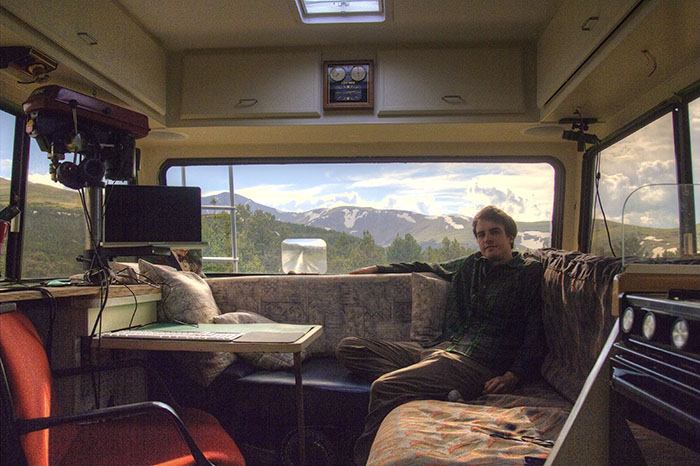

Howdy, 

My name is Kieran Czerwinski, I’m a small town ape from the redwoods of northern California that moved to Colorado to become less of an idiot. It didn’t really work, but now I have a bachelors degree in Computer Science and a minor stick up my butt in Philosophy.

I’ve always had a deep love for the process of building things. It challenges my philosophies of design and allows me to practice creativity, empathy, and logic to prioritize concerns under real-world constraints and tradeoffs. However, I believe true wisdom comes not merely from building, but objectively evaluating and learning from the resulting success and failures. It’s a beautifully cyclical, humbling, and rewarding process that I think is crucial not only to designing successful products, but to life in general.

I’ve been an Internet addict from the days of dialup. It allowed me to discover and explore a wide range of passions, giving me the hands on skills and confidence necessary to pursue an enduring journey of creation and learning. It’s an amazing resource for the collective wisdom of humanity and I think its vast potential to reshape our lives makes it humanity’s greatest creation since language itself. However, the web's potential is severely limited by its accessibility to the general populace and all to often leaves behind those who it could benefit most. As a growing web developer and designer, I’m excited to play a small part in making the web a more intuitive, accessible, and useful place for all the diverse spiders of the world.

In my free time I like to needlessly worry about the world and my largely pointless existence, tinker with 3D modeling/printing, blow up electronics, read a good book or article, and on the rare occasion, I venture outside to sun my pasty skin.