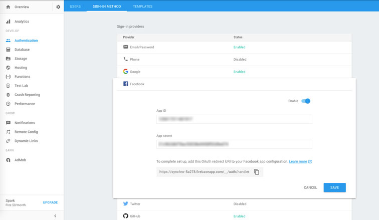

# The tutorial I wish I had when starting my Angular app

In the never ending quest to keep up with the rapdily evolving JS framework brawl, I've been learning Google's Angular, one of the most popular and powerful frameworks on the market. One of the first things one needs to think about when starting any web app of complexity is how to add secure user accounts for users to act through. After lots of searching and finding little but outdated tutorials and spotty documentation, I've compiled all the knowledge I've gained about how to create an extremely user friendly, secure, and simple authentication service (the Google way) using the latest versions of Angular, AngularFire2, and Material2. What took me a couple days of work should now take no more than an hour!

So why use AngularFire OAuth instead of creating your own authentication using something like [JWT](https://en.wikipedia.org/wiki/JSON_Web_Token) (JSON Web Tokens)? First of all, unless you're a seasoned cyber security specialist, it's generally considered the most secure approach to not try to roll your own authentication system. The exception being if you're just making a fun side project for the sake of learning that will never handle real production loads. Using authentication services such as OAuth leaves critical security implementation up to the experts and allows you to focus on other major features of your app. Enabling common OAuth providers such as Google, Facebook, and Twitter also creates a lower barrier to entry and better user experience because users don't need to worry about signing up for a whole new service and verifying their email. They may not even need to enter password credentials if they're already logged into their chosen service.

There's a number of other great benefits to using Firebase for not only your app's authentication but as your entire backend service and I'd highly suggest you read [this](http://blog.angular-university.io/angular-2-firebase/) great article about how Angular and Firebase are changing the web dev world.

# NOTICE: Sections are still under construction


# Step 1: Create Firebase App and Activate OAuth Providers
### Create a Firebase Account and App
The first step is to [create](https://accounts.google.com/signin/v2/identifier?continue=https%3A%2F%2Fconsole.firebase.google.com%2F&followup=https%3A%2F%2Fconsole.firebase.google.com%2F&osid=1&flowName=GlifWebSignIn&flowEntry=ServiceLogin) a Firebase account if you haven't already.

Then create your new app from the Firebase console and select 'Authentication' from the side nav and go to 'sign-in-method'. Here you'll see all the sign-in providers you can enable with through Firebase. You can select whatever providers you want, but this tutorial will only cover Googe, Facebook, and Github for now. 



Google is the easiest, all you have to do is select enable  and you're done. 

For Facebook you'll have to create a new app from their [developer page](https://developers.facebook.com/) and provide the Callback URL provided by Firebase to generate your App ID and App secret tokens.

You'll have to do the same for Github at the [application settings page](https://github.com/settings/applications) It'll ask you for the homepage of your website, but you can put anything here if your app doesn't have one yet. Then just enter the Firebase callback URL again and you'll now have your access tokens to fill in the blanks on Firebase

### Create Config File for Firebase Configuration
Now we're ready to start configuring Firebase in our app. Navigate to your app's Overview panel and select 'Add Firebase to your web app' and copy the config properties into a new file using the template below. 
#### config.ts
```ts
export const firebaseConfig = {
  apiKey: '<your-key>',
  authDomain: '<your-app-name>.firebaseapp.com',
  databaseURL: 'https://<your-app-name>.firebaseio.com',
  storageBucket: '<your-app-name>.appspot.com',
  messagingSenderId: '<your-messaging-sender-id>'
};
```
We could have put this config object directly in our app.module.ts file but then we wouldn't be able to exclude its very sensitive details from being commited if using Github. This file becomes a handy little 'secret' repository for any variables we wish to keep from prying eyes.

#### .gitignore
```ts
config.ts
```
Make sure to add the new config file to your gitignore file so you don't accidentally upload your app's security details for all to see.

#### app.module.ts
```ts
import { firebaseConfig } from '../config';

...

imports: [
  AngularFireModule.initializeApp(firebaseConfig),
]
```
Remember to import our firebase config object and initialize the AngularFireModule with it.

# Step 2: Installation and Component Generation

```console
 npm install firebase angularfire2 --save
```
Here we instruct NPM to install both firebase and angularfire2 to our node_modules folder and save them as dependencies in our package.json file.

```console
 ng g service auth 
```
Now we use the Angular CLI shorthand 'g' for 'generate' and instruct Angular to create a new service to be injected into our app called auth.  

```console
 ng g component users/login 
```

```console
 ng g component users/profile 
 ```
The convienient generate feature of the Angular CLI  automatically creates the user folder, files, imports,  declarations, and other boilderplate necesary for our new service and components, so we're ready to start adding our business logic right away!

These next steps are optional but it'll be handy to install Material2 and FontAwesome to help style our components later. You could use another styling library like ng-bootstrap but Google's Material2 has a lot of nice built in animations and philosophy guiding its components and will provide a better user experience. As of this writing, it's only in Beta and the docs are still under construction, but expect it to be the most compatible styling framework for Angular.

### Install Material2 and Flexbox (Optional)
```console
 npm install @angular/material @angular/flex-layout --save
```
We'll only need the [flex layout module](https://github.com/angular/flex-layout) to make our Navbar responsive but this Angular Module that injects the handy Flexbox has a number of other handy features that will be convienent for the layout of your app.

#### app.module.ts
```ts
import { 
  MdButtonModule,  
  MdMenuModule, 
  MdToolbarModule, 
  MdIconModule,
  MdInputModule
   } from '@angular/material';
import { FlexLayoutModule } from "@angular/flex-layout";

...

imports: [
  MdButtonModule,
  MdMenuModule,
  MdToolbarModule,
  MdIconModule,
  MdInputModule,
  FlexLayoutModule,
]
```

#### index.html
```ts
<link href="https://fonts.googleapis.com/icon?family=Material+Icons" rel="stylesheet">

<link href="../node_modules/@angular/material/prebuilt-themes/indigo-pink.css" rel="stylesheet">
```
We must include the actual icon assets, the full list of which can be found [here](https://material.io/icons/)

And we include a default Material theme that is required for the styling of our components. More info about Material theming can be found [here](https://material.angular.io/guide/theming)

### Install Font Awesome (Optional)
```ts
 npm install font-awesome angular2-fontawesome --save
```
Now we install the Angular Font Awesome libraries so we can add the social icons (that Material2 is missing) to our buttons. If you're super concerned with keeping your app's filesize to a miniumum you might want to take the time to find and download individual icon assets for the specific services you want.


#### .angular-cli.json
```ts
{
  "apps": [
    {
      "styles": [
        "../node_modules/font-awesome/css/font-awesome.css"
      ]
    }
  ],
  "addons": [
    "../node_modules/font-awesome/fonts/*.+(otf|eot|svg|ttf|woff|woff2)"
  ]
}
```
Here we tell our app where and how to consume our new FA icons in the angular CLI config file (which is just an Angular wrapper of a Webpack2 config file)

#### app.module.ts
```ts
import { Angular2FontawesomeModule } from 'angular2-fontawesome/angular2-fontawesome'

...

imports: [
  Angular2FontawesomeModule,
]
```

# Step 3: Creating the Backend Authentication Service
Yay! We're finally ready to get to the core business logic of our authentication system. This AuthService component does all the core functions that tie our app user's authentication to Firebase. 

#### auth.service.ts
```ts
import { Injectable } from '@angular/core';
import { 
  AngularFireDatabaseModule, 
  AngularFireDatabase, 
  FirebaseListObservable } from 'angularfire2/database';
import { AngularFireAuth } from 'angularfire2/auth';
import { Router } from "@angular/router";
import * as firebase from 'firebase';
```
First we import all our dependencies, using AngularFireDatabase modules so that we can store our user's information for later use and to access the Observable function that we'll use to subscribe to our user's login status.

```ts
@Injectable()
export class AuthService {

  authState: any = null;

  constructor(private afAuth: AngularFireAuth,
              private db: AngularFireDatabase,
              private router:Router) {

            this.afAuth.authState.subscribe((auth) => {
              this.authState = auth
            });
          }
```
Then we pass in the AngularFire objects we need as private variables to our class constructor. The private specification simply means that these objects can only be accessed and used within the scope of our AuthService class.

The above code is the most critical step in the Auth service because it subscribes to the AngularFire authState observable and returns a FirebaseAuthState object with details on our user's auth state that will allow us to determine when to show, hide, and guard application details.

When the user is logged out the state is null and when logged in, the object contains useful user details like User ID, Display Name, Profile Pic URL, etc. 


```ts
  // Returns true if user is logged in
  get authenticated(): boolean {
    return this.authState !== null;
  }

  // Returns current user data
  get currentUser(): any {
    return this.authenticated ? this.authState : null;
  }

  // Returns an observable of our user status
  get currentUserObservable(): any {
    return this.afAuth.authState
  }

  // Returns current user UID
  get currentUserId(): string {
    return this.authenticated ? this.authState.uid : '';
  }

  // Returns current user display name or Guest
  get currentUserDisplayName(): string {
    if (!this.authState) { return 'Guest' }
    else { return this.authState['displayName'] || 'User without a Name' }
  }
```
Now using getters we set up a number of useful helper functions that we can use in our app. Since classes in JS and TS are just syntatic sugar for the standard prototypal inheritance model of objects in JS. Accessors like getters and setters make functions (in this case methods) behave more like object properties and give you more control over member attributes for class. Getters simply return a value when called (i.g. this.exampleFunc), while setters specify how inputs for a method should be processed and what values returned (e.g. .exampleFunc(value))

### Social Sign In
```ts

  //// Social Auth ////

  githubLogin() {
    const provider = new firebase.auth.GithubAuthProvider()
    return this.socialSignIn(provider);
  }

  googleLogin() {
    const provider = new firebase.auth.GoogleAuthProvider()
    return this.socialSignIn(provider);
  }

  facebookLogin() {
    const provider = new firebase.auth.FacebookAuthProvider()
    return this.socialSignIn(provider);
  }

  private socialSignIn(provider) {
    return this.afAuth.auth.signInWithPopup(provider)
      .then((credential) =>  {
        this.authState = credential.user
        this.updateUserData()
      })
      .catch(error => console.log(error));
  }

  //// Sign Out ////

  signOut(): void {
    this.afAuth.auth.signOut();
    this.router.navigate(['/'])
  }

```
Here we create a reusable private function that takes the login provider as an argument and attempts to sign in through a pop up window. Once the user has entered their information, it will either be a success and then their login credentials are passed to our updateUserData function to be stored in our Firebase database. Or if there's an error, we catch it and log it to our console. (We could also provide some user feedback here)

We also set up a signOut function that simply logs the user out and redirects them to our home page.

```ts
  //// Helpers ////

  private updateUserData(): void {
  // Writes user name and email to realtime db
  // useful if your app displays information about users or for admin features

    let path = `users/${this.currentUserId}`; // Endpoint on firebase
    let data = {
                  email: this.authState.email,
                  name: this.authState.displayName
                }

    this.db.object(path).update(data)
    .catch(error => console.log(error));
  }
}
```
Here's the optional helper function that saves our user data to our realtime Firebase database. This could be very useful later for administrative features and collecting more data on users.

# Step 4: Creating the User Login Component
#### users/login/login.component.ts
```ts
import { Component, OnInit, HostBinding } from '@angular/core';
import { Router } from '@angular/router';
import { AngularFireAuth } from 'angularfire2/auth';
// Do not import from 'firebase' as you'd lose the tree shaking benefits
import * as firebase from 'firebase/app'
import { AuthService } from "../../auth.service";

@Component({
  selector: 'app-login',
  templateUrl: './login.component.html',
  styleUrls: ['./login.component.css']
})
export class LoginComponent implements OnInit {

  constructor(public auth: AuthService,
              private router: Router) { }

  private afterSignIn(): void {
    // Do after login stuff here, such router redirects, toast messages, etc.
    this.router.navigate(['/profile']);
  }

  signInWithGithub(): void {
    this.auth.githubLogin()
    .then(() => this.afterSignIn());
  }
  signInWithGoogle(): void {
    this.auth.googleLogin()
      .then(() => this.afterSignIn());
  }
  signInWithFacebook(): void {
    this.auth.facebookLogin()
      .then(() => this.afterSignIn());
  }

  ngOnInit() { }
}
```
Now we can start setting up our login component where we import our Auth Service that we just created to access our accessor OAuth functions. Here we're using promises as a nice abstraction to specifiy the callbacks fired after we sign in with our auth service functions. Here we're just routing our users to the profile page (that we'll create later) so they can see their user info and that they're signed in. This could obviously be changed to whatever you please.

#### users/login/login.component.html
```html
<h1>Login Providers:</h1>
<div id="signin-buttons">
  <span class="error" *ngIf="error">{{ error }}</span>
  <div *ngIf="!auth.currentUser; else alreadyLoggedIn">
  <button md-raised-button (click)="signInWithFacebook()" class="login" color="primary"><fa [name]="'facebook'"></fa> Login With Facebook</button>
  <button md-raised-button (click)="signInWithGoogle()" class="login" color="primary"><fa [name]="'google'"></fa> Login With Google</button>
  <button md-raised-button (click)="signInWithGithub()" class="login" color="primary"><fa [name]="'github'"></fa> Login With Github</button>
</div>

<ng-template #alreadyLoggedIn>
    already logged in!
</ng-template>
```
Now we create the view for the login component. We use the [ngIf](https://angular.io/docs/ts/latest/api/common/index/NgIf-directive.html) Angular directive to conditionally render elements for any errors that might occur while signing in. We also conditionally set the template with the list of provider signin buttons to be conditionally displayed if there is no current user, or else we display a template that simply says 'already logged in!' if the user navigates back to the login page after signing in. 

# Step 5: Creating the User Profile Component
#### users/profile/profile.component.ts
```ts
import { Component, OnInit } from '@angular/core';
import { AuthService } from "../../auth.service";

@Component({
  selector: 'app-profile',
  templateUrl: './profile.component.html',
  styleUrls: ['./profile.component.css']
})
export class ProfileComponent implements OnInit {

  constructor(public auth: AuthService) { }

  logout() {
    this.auth.signOut();
  }

  ngOnInit() {
  }

}
```
The profile component's class is very simple, just a logout function that we'll use to attach to the logout button in the profile view.

#### users/profile/profile.component.html
```html
  <!-- User logged in -->
  <div *ngIf="auth.currentUser">
    <h3>Hi there, {{ auth.currentUserDisplayName }}</h3>
    
    <br>
    <button md-raised-button color="primary" (click)="logout()"> Logout</button>
 </div>
  <!-- User NOT logged in -->
  <div *ngIf="!auth.currentUser">
    <h3>Hi there, {{ auth.currentUserDisplayName }}</h3>
    <p>Login to get started...</p>
    <button md-raised-button color="primary" routerLink="/login">Login</button>
  </div>
```
This is a bare bones profile page that simply displays the current user's profile picture if provided or else sets a default if undefined and a logout button to signout of our account.

If the user isn't logged in while navigating to this page, we ask them nicely to login. To prevent this from happening we could use an ngIf in our navbar to only show this when users are logged in, but it could be a wise design choice to show our potential users the pages they could have access to if they signin. 

Some pages however we never want unauthorised users to be able to access. These pages definitly should be conditionally rendered in our navbar AND guarded against access with our route guard we'll construct below.


# Step 6: Guarding Authorized Routes
#### auth.guard.ts
```ts
import { Injectable } from '@angular/core';
import { 
  CanActivate, 
  ActivatedRouteSnapshot, 
  RouterStateSnapshot, 
  Router } from '@angular/router';
import { Observable } from 'rxjs/Observable';
import { AuthService } from './auth.service';
import 'rxjs/add/operator/do';
import 'rxjs/add/operator/map';
import 'rxjs/add/operator/take';

@Injectable()
export class AuthGuard implements CanActivate {
  constructor(private auth: AuthService, private router: Router) {}

  canActivate(
    next: ActivatedRouteSnapshot,
    state: RouterStateSnapshot): Observable<any> | boolean {
      if (this.auth.authenticated) { return true; }

      return this.auth.currentUserObservable
         .take(1)
         .map(user => !!user)
         .do(loggedIn => {
           if (!loggedIn) {
             console.log("access denied")
             this.router.navigate(['/login']);
           }
         })

  }
}
```
Here we set up an observable to subscribe to the login state of our users and use the CanActivate function to specify the route we're activating with 'ActivatedRouteSnapshot', if we have a current user we return true and the canActivate function allows access to our route, if false we redirect our users to the login page and log "access denied" this could be easily replaced with a toast message or similar alert.
